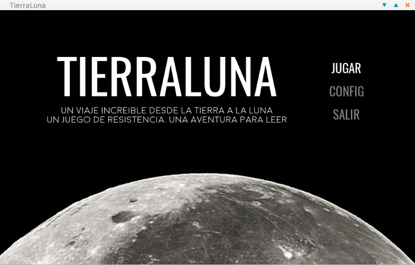

# TierraLuna

Este proyecto comenzó como una serie de tutoriales creados por el Equipo de Huayra GNU/Linux para aprender programación de videojuegos utilizando **PILAS-engine** y **Huayra**. 
Se trata de un viaje a la luna donde se pondrá a prueba nuestra habilidad, paciencia y temple. **TierraLuna** es un juego para leer, ya que en el camino aprenderemos conceptos de astronomía, geografía, física y ecología, mientras intentamos superar los cinco niveles y alunizar.




## Autores

**TierraLuna** fue realizado por

* Diego Accorinti
* Claudio *Maléfico* Andaur
* Rodrigo Manresa

para Huayra GNU/Linux. 

## Temas

En **Tierra-Luna** podemos elegir *temas* que modifican los gráficos del juego con distintas estéticas. Tanto los sprites (naves y objetos móviles) como los decorados, pueden modificarse eligiendo el tema que más te guste. 
Pero no sólo los gráficos pueden cambiarse, también puede elegirse el texto que acompaña al jugador durante el viaje. De esta manera, Tierra-Luna puede utilizarse para contar practicamente cualquier cosa, jugando. 
Se distribuyen dos temas con Tierra-Luna, el tema original que nos cuenta sobre astronomía a medida que viajamos hacia la Luna, y el tema "Steampunk" que nos cuenta sobre la literatura de ciencia-ficción del S.XIX.


## Cómo escribir tus propias aventuras con **Tierra-Luna**

Copia cualquiera de las carpetas dentro del directorio *`temas`*, y renómbralo.
Puedes modificar o reemplazar varios o todos los gráficos de la carpeta `imagenes` (mantén los nombres de los archivos).
Escribe el texto de tu aventura como texto plano usando un editor de texto. Puedes usar las siguientes etiquetas al comienzo de una linea para indicar situaciones especiales:

Utiliza la etiqueta `<NIVEL#>` para indicar el tipo de nivel que deseas cargar (valores aceptados son `<NIVEL1>`, `<NIVEL2>` hasta `<NIVEL5>`).
Utiliza la etiqueta `<EVENTO#>` para que aparezca o bien un "satelite" o bien una "estacion reparadora" (`<EVENTO1>` y `<EVENTO2>`)
Utiliza la etiqueta `<FIN>` para indicar cuando el juego debe terminar su recorrido.
Utiliza la etiqueta `<LOOP>` para indicar que todo debe volver a empezar.

Por ejemplo la linea:

```
<NIVEL2>Un nivel cualquiera</NIVEL2>
```

Haría que se imprima el texto "Un nivel cualquiera", al mismo tiempo que cambiarian los fondos y sprites del juego por los que corresponden a una pantalla de nivel 2.

## Instalación del tema

Para que **Tierra-Luna** pueda reconocer correctamente tu tema, debes editar el archivo *temas-dic.py*, indicando el nombre del tema, y los items que incluye. 
Puedes modificar unicamente los textos por ejemplo y utilizar los graficos de otros temas.

## Licencia

Software libre bajo licencia GPL3 

This program is free software; you can redistribute it and/or modify
 it under the terms of the GNU General Public License as published by
the Free Software Foundation; either version 2 of the License, or
(at your option) any later version.

This program is distributed in the hope that it will be useful,
but WITHOUT ANY WARRANTY; without even the implied warranty of
MERCHANTABILITY or FITNESS FOR A PARTICULAR PURPOSE.  See the
GNU General Public License for more details.
